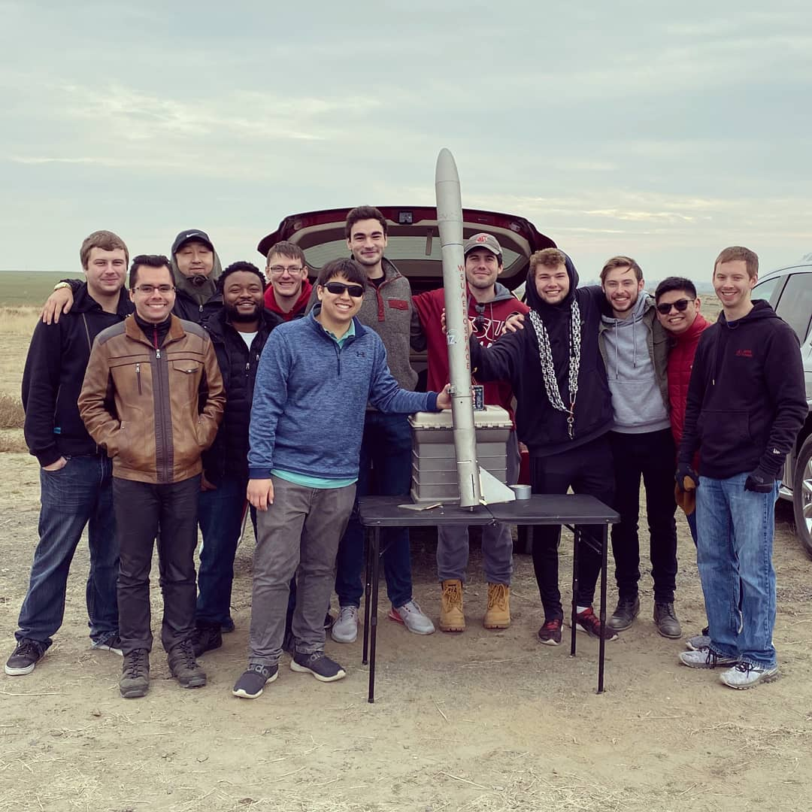
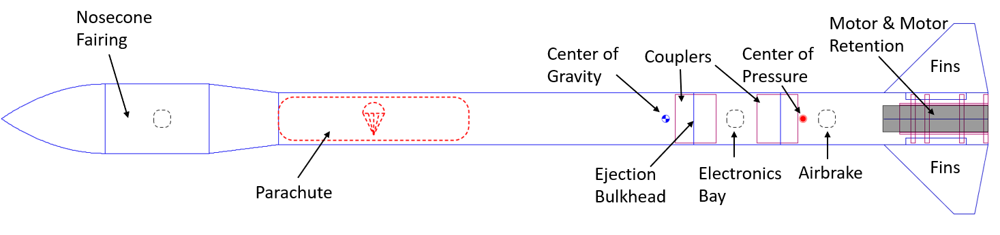
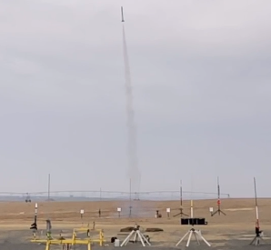
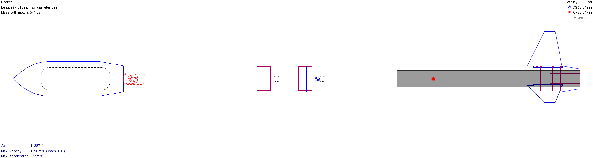
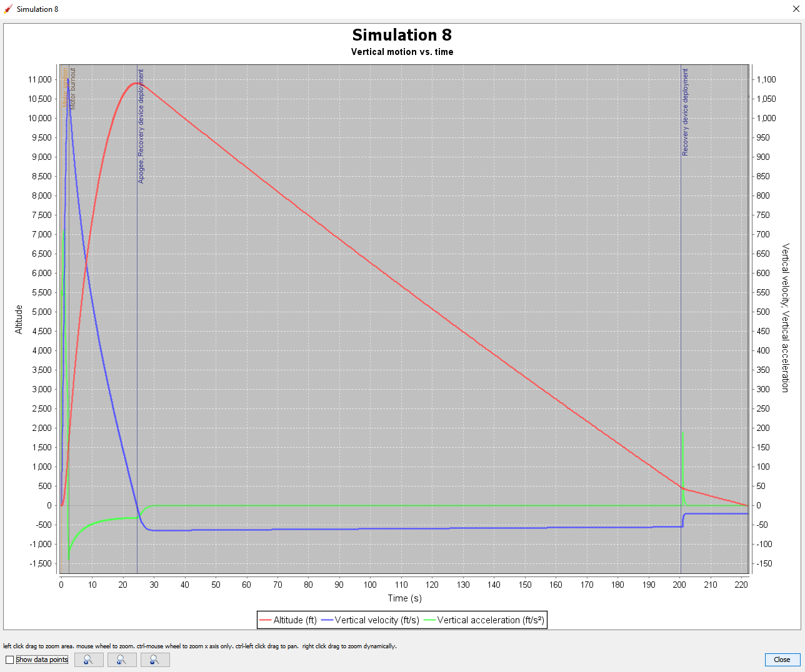
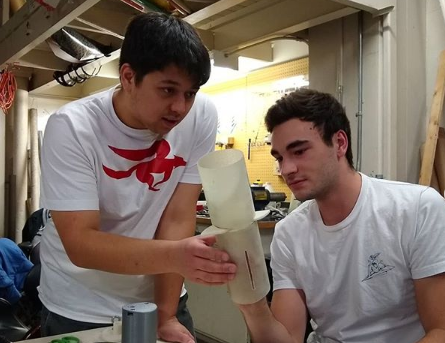
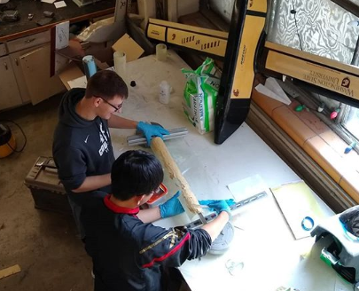

# Hydra Mk I Overview

This project covers my contributions as project lead for the Washington State University Aerospace Club rocket. This rocket was the club's 2019-2020 entry to the [Intercollegiate Rocket Engineering Competition (IREC)](https://spaceportamericacup.com/), hosted by the [Experimental Sounding Rocket Association](https://www.soundingrocket.org/).

## Author

[Jonathan Cochran](https://github.com/ionzzu)

## Background

- Spaceport America Cup is IREC's rocketry competition
- This competition challenges students to design, build, and launch a rocket to an apogee of 10,000ft and launch a payload
- Payloads are recommended to be creative scientific experiments and technology demonstrations.

## Directory

- [Team Organization](#team-organization): organization of the rocketry team
- [Spaceport America Cup Application](#spaceport-america-cup-application): acceptance to participate in Spaceport America Cup
- [Fundraising](#fundraising): fundraising for the club so we could afford travel for competition
- [Certifications](#certifications): certify members in high power rocketry flight
- [Documentation Protocols](#documentation-protocols): develop robust documentation protocols
- [Test Rockets](#test-rockets): design, build, and launch two test rockets
    - [Harbinger IV](#harbinger-iv)
    - [Harbinger V](#harbinger-v)
- [Hydra Mk I](#hydra-mk-i): design and build structures, avionics, payload, and recovery systems for Hydra Mk I
- [Challenges](#challenges): challenges encountered during the project

## Team Organization

- Sub-team leads were selected to delegate and become subject matter experts for respective parts of the rocket
    - Structures: design and build all the structures in the rocket
    - Avionics: control all the electronic systems on the rocket
    - Payload: creating the scientific payload that will be launched to conduct an experiment
    - Recovery: ensure the safe return of the rocket and the payload after launch
- Interviews were conducted and leads selected based on prior experience and passion for the project
- See [role information documentation](docs/info/rocket_role_information_2019.pdf)
- Hosted weekly project work meetings where members could collaborate
- Created and presented weekly presentations to the larger Aerospace Club
- Led direction of overall project and encouraged sub-team leads to make independent decisions
- Each team had 4-7 members for a total of 26 members in the group

## Spaceport America Cup Application

- Submitted early in project development (October)
- Required motivations and planned technical work
- See [SAC Cover letter](docs/SAC_coverletter.pdf)

## Fundraising

- Designed a creative [flyer](docs/WSU_rocketflyer_09082019.pdf) and sent it to alumni and local companies
- Submitted the club to WSU's annual fundraising campaign
- Raised ~$3300

## Certifications

- Students interested in rocketry certifications were encouraged to build and launch personal rockets when we launched test rockets
- I provided guidance for building rockets and paperwork for obtaining certification from the [National Association of Rocketry](https://www.nar.org/)

## Documentation Protocols

- Documentation had been an issue in previous years
- To remedy this, I established policies to create and store documentation on the club's computer network.

These included:
- Development of [training materials](docs/training_info)
- Creation of [part documentation](docs/part_info) for safe and robust design and manufacturing practices
- [Timelines](docs/timelines) for project milestones
- [Bills of Materials](docs/bill_of_materials) for material acquisition and purchasing requests
- Conducting weekly design reviews with sub-team leads beginning January 2020

## Test Rockets

### Harbinger IV

- First planned test rocket, launched in November 2019
- Tested initial structure, avionics, and recovery design
- Established and refined manufacturing protocol and capability

#### OpenRocket Design

#### Harbinger IV Launch

### Harbinger V

- Second test rocket, planned for March 2020 (cancelled)
- Planned testing involved CO2 ejection method, payload ejection, and improved manufacturing

## Hydra Mk I

#### OpenRocket Design

#### Simulated Launch Trajectory

- Max apogee is overestimated so it can be adjusted to 10,000ft with an air brake

### Structures

Air brake:
- Controls ascent of rocket by increasing drag
- Monitored by a feedback algorithm to predict and adjust air brake position

#### Air Brake Prototype

Other structure components are slightly adjusted dimensions from those used in Harbinger IV

### Avionics

- Deploys recovery systems, collects data, activates payloads, and interprets telemetry data
- Custom board manufactured for installation into electronics bay

### Payload

- Design revised to a monocopter due to timelines and challenges developing initial concept
- Auto rotates to designated location on ground
- Relays signal to act as beacon for locating rocket
- Allows for more time to obtain line of sight radio

### Recovery

- Bulkhead designed including areas for CO2 canisters and a black powder backup
- Drogue and main parachutes deploy to slow rocket descent

### Manufacturing

Rocket hull is manufactured in-house via fiberglass rolling

Work was completed up to mid-February when the university began shutting down operations for Covid-19.

## Challenges

Undertaking the project lead role made this one of the most challenging projects I have ever worked on. However, it is one of the more rewarding experiences I have had so far.

These are some of my learnings:
- Documentation is extremely important for understanding past work and knowledge transfer
- Managing any project requires immense time and patience
- Plan extra time for unexpected delays
- Plan extra money for unforeseen expenses
- It can be difficult to maintain continuity in volunteer projects
- Delegation is very useful in larger groups since it is impossible to be omnipresent
- Time management and organization are essential
- Enjoying the moment is a key ingredient to success

Another hindrance was the advent of Covid-19. This forced us to cancel all work and abandon the project in hopes of competing the following year. Unfortunately, this was the senior year of my undergraduate program. The aftermath was an abundance of loose ends for the project that would never get tied up. The silver lining is that much of the work required for design and manufacturing was documented during my tenure so students in future years could benefit.

## Acknowledgment

A huge thank you to [WSU Aerospace](https://hub.wsu.edu/aerospace/) for the opportunity and experience!
